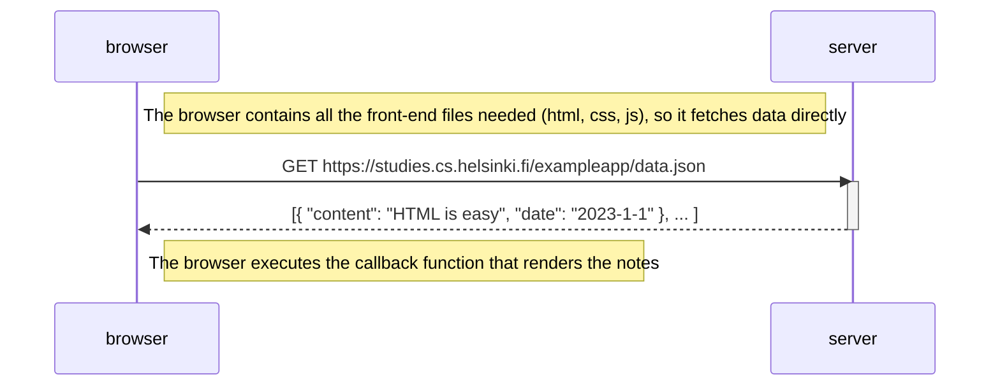

```mermaid
sequenceDiagram
    participant browser
    participant server

        Note right of browser: The browser contains all the front-end files needed (html, css, js), so it fetches data directly

    browser->>server: GET https://studies.cs.helsinki.fi/exampleapp/data.json
    activate server
    server-->>browser: [{ "content": "HTML is easy", "date": "2023-1-1" }, ... ]
    deactivate server

        Note right of browser: The browser executes the callback function that renders the notes

```
